# [📈 Live Status](https://demo.upptime.js.org): <!--live status--> **🟧 Partial outage**

This repository contains the open-source uptime monitor and status page for [alice-e-still](https://demo.upptime.js.org), powered by [Upptime](https://github.com/upptime/upptime).

With [Upptime](https://upptime.js.org), you can get your own unlimited and free uptime monitor and status page, powered entirely by a GitHub repository. We use [Issues](https://github.com/alice-e-still/boldlight-upptime-test/issues) as incident reports, [Actions](https://github.com/alice-e-still/boldlight-upptime-test/actions) as uptime monitors, and [Pages](https://demo.upptime.js.org) for the status page.

<!--start: status pages-->
<!-- This summary is generated by Upptime (https://github.com/upptime/upptime) -->
<!-- Do not edit this manually, your changes will be overwritten -->
<!-- prettier-ignore -->
| URL | Status | History | Response Time | Uptime |
| --- | ------ | ------- | ------------- | ------ |
|  [Altyn Dala](https://altyndala.org) | 🟩 Up | [altyn-dala.yml](https://github.com/alice-e-still/boldlight-upptime-test/commits/HEAD/history/altyn-dala.yml) | 

 1069ms
     
 | 

<a href="https://alice-e-still.github.io/boldlight-upptime-test/history/altyn-dala">100.00%</a>
    

|  [ARUK](https://www.alzheimersresearchuk.org) | 🟩 Up | [aruk.yml](https://github.com/alice-e-still/boldlight-upptime-test/commits/HEAD/history/aruk.yml) | 

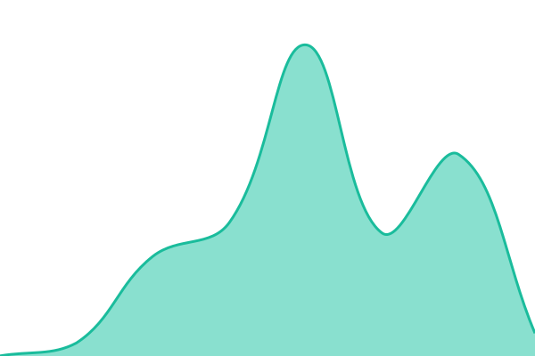 2075ms
     
 | 

<a href="https://alice-e-still.github.io/boldlight-upptime-test/history/aruk">100.00%</a>
    

|  [Back from the Brink](https://naturebftb.co.uk) | 🟩 Up | [back-from-the-brink.yml](https://github.com/alice-e-still/boldlight-upptime-test/commits/HEAD/history/back-from-the-brink.yml) | 

 982ms
     
 | 

<a href="https://alice-e-still.github.io/boldlight-upptime-test/history/back-from-the-brink">100.00%</a>
    

|  [Dynamic Dunescapes](https://dynamicdunescapes.co.uk) | 🟩 Up | [dynamic-dunescapes.yml](https://github.com/alice-e-still/boldlight-upptime-test/commits/HEAD/history/dynamic-dunescapes.yml) | 

 1057ms
     
 | 

<a href="https://alice-e-still.github.io/boldlight-upptime-test/history/dynamic-dunescapes">100.00%</a>
    

|  [Farm Wildlife](https://farmwildlife.info) | 🟩 Up | [farm-wildlife.yml](https://github.com/alice-e-still/boldlight-upptime-test/commits/HEAD/history/farm-wildlife.yml) | 

 916ms
     
 | 

<a href="https://alice-e-still.github.io/boldlight-upptime-test/history/farm-wildlife">100.00%</a>
    

|  [KRUK](https://kidneyresearchuk.org) | 🟩 Up | [kruk.yml](https://github.com/alice-e-still/boldlight-upptime-test/commits/HEAD/history/kruk.yml) | 

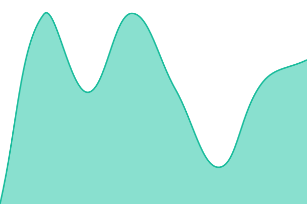 2149ms
     
 | 

<a href="https://alice-e-still.github.io/boldlight-upptime-test/history/kruk">100.00%</a>
    

|  [Little Tern Project](https://littleternproject.org.uk) | 🟩 Up | [little-tern-project.yml](https://github.com/alice-e-still/boldlight-upptime-test/commits/HEAD/history/little-tern-project.yml) | 

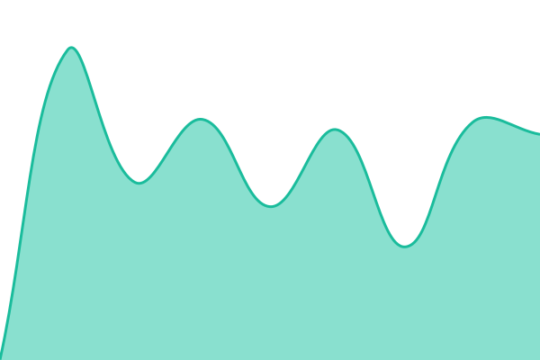 866ms
     
 | 

<a href="https://alice-e-still.github.io/boldlight-upptime-test/history/little-tern-project">100.00%</a>
    

|  [After Minerals](https://afterminerals.com) | 🟩 Up | [after-minerals.yml](https://github.com/alice-e-still/boldlight-upptime-test/commits/HEAD/history/after-minerals.yml) | 

 983ms
     
 | 

<a href="https://alice-e-still.github.io/boldlight-upptime-test/history/after-minerals">100.00%</a>
    

|  [Project Godwit](https://projectgodwit.org.uk) | 🟩 Up | [project-godwit.yml](https://github.com/alice-e-still/boldlight-upptime-test/commits/HEAD/history/project-godwit.yml) | 

 5656ms
     
 | 

<a href="https://alice-e-still.github.io/boldlight-upptime-test/history/project-godwit">100.00%</a>
    

|  [Save Our Seabed](https://saveourseabed.co.uk) | 🟩 Up | [save-our-seabed.yml](https://github.com/alice-e-still/boldlight-upptime-test/commits/HEAD/history/save-our-seabed.yml) | 

 973ms
     
 | 

<a href="https://alice-e-still.github.io/boldlight-upptime-test/history/save-our-seabed">100.00%</a>
    

|  [RSPB BAI Hub](https://baihub.rspb.org.uk) | 🟩 Up | [rspb-bai-hub.yml](https://github.com/alice-e-still/boldlight-upptime-test/commits/HEAD/history/rspb-bai-hub.yml) | 

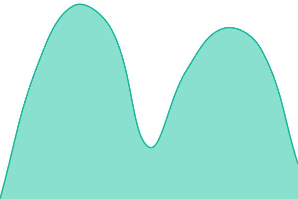 2613ms
     
 | 

<a href="https://alice-e-still.github.io/boldlight-upptime-test/history/rspb-bai-hub">100.00%</a>
    

|  [Save Vultures](https://save-vultures.org) | 🟩 Up | [save-vultures.yml](https://github.com/alice-e-still/boldlight-upptime-test/commits/HEAD/history/save-vultures.yml) | 

 1033ms
     
 | 

<a href="https://alice-e-still.github.io/boldlight-upptime-test/history/save-vultures">100.00%</a>
    

|  [Rethink Nature](https://rethinknature.co.uk) | 🟩 Up | [rethink-nature.yml](https://github.com/alice-e-still/boldlight-upptime-test/commits/HEAD/history/rethink-nature.yml) | 

 905ms
     
 | 

<a href="https://alice-e-still.github.io/boldlight-upptime-test/history/rethink-nature">100.00%</a>
    

|  [Upper & Bedford Ouse Catchment Partnership](https://ubocp.org.uk) | 🟩 Up | [upper-and-bedford-ouse-catchment-partnership.yml](https://github.com/alice-e-still/boldlight-upptime-test/commits/HEAD/history/upper-and-bedford-ouse-catchment-partnership.yml) | 

 810ms
     
 | 

<a href="https://alice-e-still.github.io/boldlight-upptime-test/history/upper-and-bedford-ouse-catchment-partnership">100.00%</a>
    

|  [Visit Sherwood](https://visitsherwood.co.uk) | 🟩 Up | [visit-sherwood.yml](https://github.com/alice-e-still/boldlight-upptime-test/commits/HEAD/history/visit-sherwood.yml) | 

 1020ms
     
 | 

<a href="https://alice-e-still.github.io/boldlight-upptime-test/history/visit-sherwood">100.00%</a>
    

|  [RSPB Wild Challence](https://wildchallenge.rspb.org.uk) | 🟩 Up | [rspb-wild-challence.yml](https://github.com/alice-e-still/boldlight-upptime-test/commits/HEAD/history/rspb-wild-challence.yml) | 

 1593ms
     
 | 

<a href="https://alice-e-still.github.io/boldlight-upptime-test/history/rspb-wild-challence">100.00%</a>
    

|  [For Baby's Sake](https://forbabyssake.org.uk) | 🟩 Up | [for-baby-s-sake.yml](https://github.com/alice-e-still/boldlight-upptime-test/commits/HEAD/history/for-baby-s-sake.yml) | 

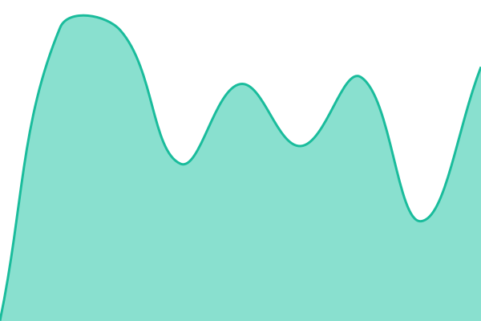 1009ms
     
 | 

<a href="https://alice-e-still.github.io/boldlight-upptime-test/history/for-baby-s-sake">100.00%</a>
    

|  [Cats Protection Audiences](https://audiences.cats.org.uk) | 🟩 Up | [cats-protection-audiences.yml](https://github.com/alice-e-still/boldlight-upptime-test/commits/HEAD/history/cats-protection-audiences.yml) | 

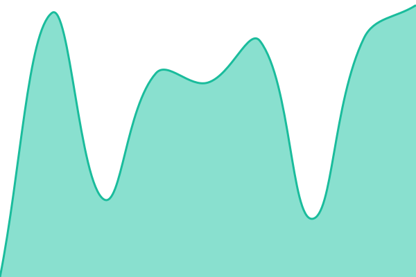 2310ms
     
 | 

<a href="https://alice-e-still.github.io/boldlight-upptime-test/history/cats-protection-audiences">100.00%</a>
    

|  [Parkrun (Donate)](https://donate.parkrun.com) | 🟩 Up | [parkrun-donate.yml](https://github.com/alice-e-still/boldlight-upptime-test/commits/HEAD/history/parkrun-donate.yml) | 

 1321ms
     
 | 

<a href="https://alice-e-still.github.io/boldlight-upptime-test/history/parkrun-donate">100.00%</a>
    

|  [Nurture BioBank](https://nurturebiobank.org) | 🟩 Up | [nurture-bio-bank.yml](https://github.com/alice-e-still/boldlight-upptime-test/commits/HEAD/history/nurture-bio-bank.yml) | 

 1017ms
     
 | 

<a href="https://alice-e-still.github.io/boldlight-upptime-test/history/nurture-bio-bank">100.00%</a>
    

|  [WDC](https://whales.org) | 🟩 Up | [wdc.yml](https://github.com/alice-e-still/boldlight-upptime-test/commits/HEAD/history/wdc.yml) | 

 1535ms
     
 | 

<a href="https://alice-e-still.github.io/boldlight-upptime-test/history/wdc">100.00%</a>
    

|  [Edon Initiative](https://edon-initiative.org) | 🟩 Up | [edon-initiative.yml](https://github.com/alice-e-still/boldlight-upptime-test/commits/HEAD/history/edon-initiative.yml) | 

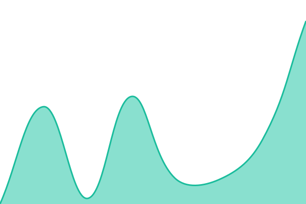 4642ms
     
 | 

<a href="https://alice-e-still.github.io/boldlight-upptime-test/history/edon-initiative">100.00%</a>
    

|  [Curlew Life](https://curlewlife.org) | 🟩 Up | [curlew-life.yml](https://github.com/alice-e-still/boldlight-upptime-test/commits/HEAD/history/curlew-life.yml) | 

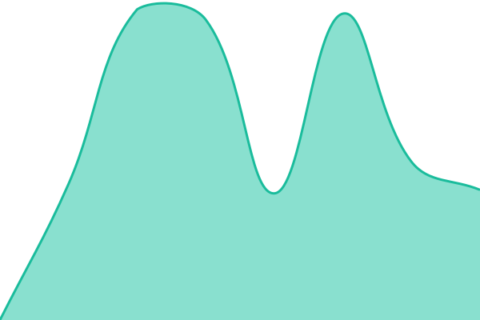 5163ms
     
 | 

<a href="https://alice-e-still.github.io/boldlight-upptime-test/history/curlew-life">100.00%</a>
    

|  [Restore BCR](https://restore-bcr.co.uk) | 🟩 Up | [restore-bcr.yml](https://github.com/alice-e-still/boldlight-upptime-test/commits/HEAD/history/restore-bcr.yml) | 

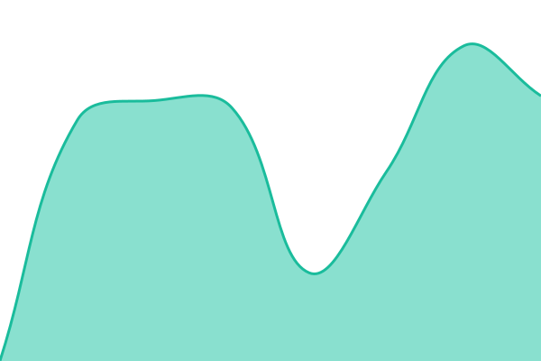 1115ms
     
 | 

<a href="https://alice-e-still.github.io/boldlight-upptime-test/history/restore-bcr">100.00%</a>
    

|  [Atlantic Guardians](https://atlanticguardians.org) | 🟩 Up | [atlantic-guardians.yml](https://github.com/alice-e-still/boldlight-upptime-test/commits/HEAD/history/atlantic-guardians.yml) | 

 2314ms
     
 | 

<a href="https://alice-e-still.github.io/boldlight-upptime-test/history/atlantic-guardians">100.00%</a>
    

|  [MAGPAS](https://magpas.org.uk) | 🟩 Up | [magpas.yml](https://github.com/alice-e-still/boldlight-upptime-test/commits/HEAD/history/magpas.yml) | 

 1301ms
     
 | 

<a href="https://alice-e-still.github.io/boldlight-upptime-test/history/magpas">100.00%</a>
    

|  [NerdFest](https://nerdfest.org.uk) | 🟩 Up | [nerd-fest.yml](https://github.com/alice-e-still/boldlight-upptime-test/commits/HEAD/history/nerd-fest.yml) | 

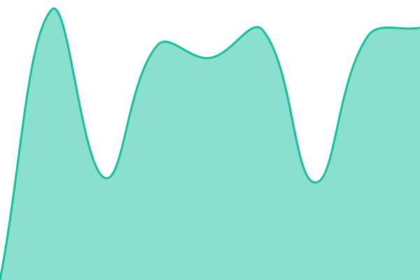 1519ms
     
 | 

<a href="https://alice-e-still.github.io/boldlight-upptime-test/history/nerd-fest">100.00%</a>
    

|  [Ring Ouzel](https://ringouzel.info) | 🟩 Up | [ring-ouzel.yml](https://github.com/alice-e-still/boldlight-upptime-test/commits/HEAD/history/ring-ouzel.yml) | 

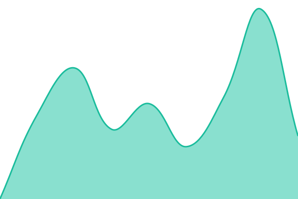 652ms
     
 | 

<a href="https://alice-e-still.github.io/boldlight-upptime-test/history/ring-ouzel">100.00%</a>
    

|  [Ethiopiaid (UK)](https://ethiopiaid.org.uk) | 🟩 Up | [ethiopiaid-uk.yml](https://github.com/alice-e-still/boldlight-upptime-test/commits/HEAD/history/ethiopiaid-uk.yml) | 

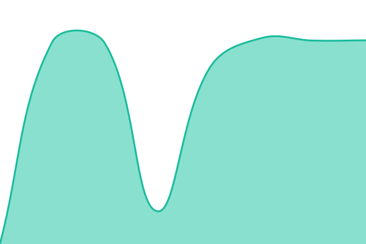 2080ms
     
 | 

<a href="https://alice-e-still.github.io/boldlight-upptime-test/history/ethiopiaid-uk">100.00%</a>
    

|  [Ethiopiaid (Ireland)](https://ethiopiaid.ie) | 🟩 Up | [ethiopiaid-ireland.yml](https://github.com/alice-e-still/boldlight-upptime-test/commits/HEAD/history/ethiopiaid-ireland.yml) | 

 1825ms
     
 | 

<a href="https://alice-e-still.github.io/boldlight-upptime-test/history/ethiopiaid-ireland">100.00%</a>
    

|  [RSPB Groups](https://group.rspb.org.uk/bedford/) | 🟩 Up | [rspb-groups.yml](https://github.com/alice-e-still/boldlight-upptime-test/commits/HEAD/history/rspb-groups.yml) | 

 1832ms
     
 | 

<a href="https://alice-e-still.github.io/boldlight-upptime-test/history/rspb-groups">100.00%</a>
    

|  [Boldlight Site](https://boldlight.co.uk) | 🟩 Up | [boldlight-site.yml](https://github.com/alice-e-still/boldlight-upptime-test/commits/HEAD/history/boldlight-site.yml) | 

 3305ms
     
 | 

<a href="https://alice-e-still.github.io/boldlight-upptime-test/history/boldlight-site">100.00%</a>
    

|  [Boldlight Studio](https://boldlight.studio) | 🟩 Up | [boldlight-studio.yml](https://github.com/alice-e-still/boldlight-upptime-test/commits/HEAD/history/boldlight-studio.yml) | 

 671ms
     
 | 

<a href="https://alice-e-still.github.io/boldlight-upptime-test/history/boldlight-studio">100.00%</a>
    

|  [Boldlight Team](https://boldlight.team) | 🟩 Up | [boldlight-team.yml](https://github.com/alice-e-still/boldlight-upptime-test/commits/HEAD/history/boldlight-team.yml) | 

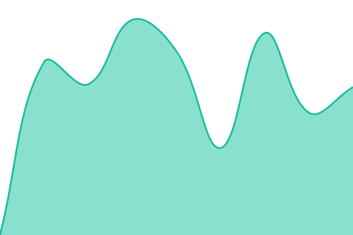 1203ms
     
 | 

<a href="https://alice-e-still.github.io/boldlight-upptime-test/history/boldlight-team">100.00%</a>
    

|  [Boldlight Wiki](https://boldlight.wiki) | 🟩 Up | [boldlight-wiki.yml](https://github.com/alice-e-still/boldlight-upptime-test/commits/HEAD/history/boldlight-wiki.yml) | 

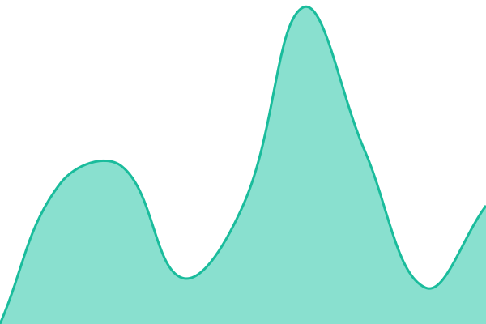 3874ms
     
 | 

<a href="https://alice-e-still.github.io/boldlight-upptime-test/history/boldlight-wiki">100.00%</a>
    

|  [Smyth Accountants](https://smythaccountants.co.uk) | 🟩 Up | [smyth-accountants.yml](https://github.com/alice-e-still/boldlight-upptime-test/commits/HEAD/history/smyth-accountants.yml) | 

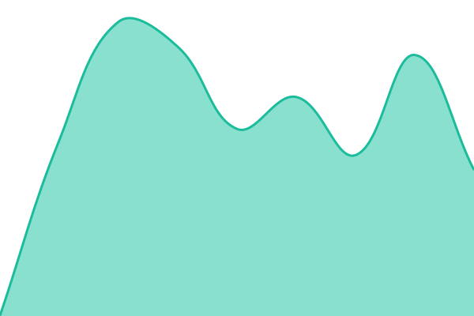 797ms
     
 | 

<a href="https://alice-e-still.github.io/boldlight-upptime-test/history/smyth-accountants">100.00%</a>
    

|  [Sky Badger](https://skybadger.co.uk) | 🟥 Down | [sky-badger.yml](https://github.com/alice-e-still/boldlight-upptime-test/commits/HEAD/history/sky-badger.yml) | 

 273ms
     
 | 

<a href="https://alice-e-still.github.io/boldlight-upptime-test/history/sky-badger">0.00%</a>
    

<!--end: status pages-->

[**Visit our status website →**](https://demo.upptime.js.org)

## 📄 License

- Powered by: [Upptime](https://github.com/upptime/upptime)
- Code: [MIT](./LICENSE) © [Anand Chowdhary](https://anandchowdhary.com), supported by [Pabio](https://pabio.com)
- Data in the `./history` directory: [Open Database License](https://opendatacommons.org/licenses/odbl/1-0/)
